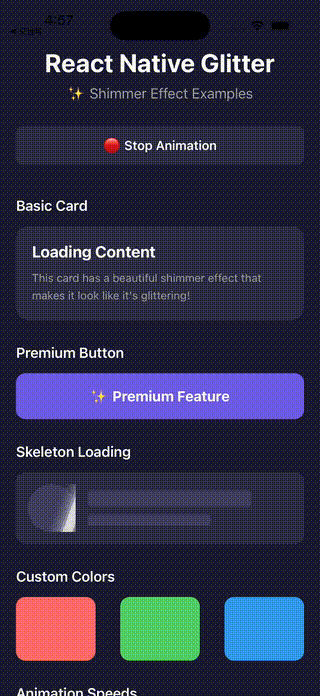

# react-native-glitter

✨ A beautiful shimmer/glitter effect component for React Native. Add a sparkling diagonal shine animation to any component!

Works with both **React Native CLI** and **Expo** projects - no native dependencies required!


## Demo

<p align="center">
  
</p>

## Features

- 🚀 **Zero native dependencies** - Pure JavaScript/TypeScript implementation
- 📱 **Cross-platform** - Works on iOS, Android, and Web
- 🎨 **Customizable** - Control color, speed, angle, and more
- ⚡ **Performant** - Uses native driver for smooth 60fps animations
- 🔧 **TypeScript** - Full TypeScript support with type definitions
- ✨ **Animation Modes** - Normal, expand, and shrink effects

## Installation

```bash
# Using npm
npm install react-native-glitter

# Using yarn
yarn add react-native-glitter
```

## Usage

### Basic Usage

Wrap any component with `<Glitter>` to add a shimmer effect:

```tsx
import { Glitter } from 'react-native-glitter';

function MyComponent() {
  return (
    <Glitter>
      <View style={styles.card}>
        <Text>This content will shimmer!</Text>
      </View>
    </Glitter>
  );
}
```

### Animation Modes

Control how the shimmer line behaves during animation:

```tsx
// Normal - constant size (default)
<Glitter mode="normal">
  <View style={styles.box} />
</Glitter>

// Expand - starts small and grows
<Glitter mode="expand">
  <View style={styles.box} />
</Glitter>

// Shrink - starts full size and shrinks
<Glitter mode="shrink">
  <View style={styles.box} />
</Glitter>
```

### Shrink/Expand Positions

For `shrink` and `expand` modes, control where the line shrinks to or expands from:

```tsx
// Shrink to top
<Glitter mode="shrink" position="top">
  <View style={styles.box} />
</Glitter>

// Shrink to center (default)
<Glitter mode="shrink" position="center">
  <View style={styles.box} />
</Glitter>

// Shrink to bottom
<Glitter mode="shrink" position="bottom">
  <View style={styles.box} />
</Glitter>
```

### Skeleton Loading

Create beautiful skeleton loading states:

```tsx
import { Glitter } from 'react-native-glitter';

function SkeletonLoader() {
  return (
    <Glitter duration={1200} delay={300}>
      <View style={styles.skeletonBox} />
    </Glitter>
  );
}
```

### Premium Button

Add a luxurious shimmer to buttons:

```tsx
import { Glitter } from 'react-native-glitter';

function PremiumButton() {
  return (
    <Glitter color="rgba(255, 215, 0, 0.5)" angle={25}>
      <TouchableOpacity style={styles.button}>
        <Text>✨ Premium Feature</Text>
      </TouchableOpacity>
    </Glitter>
  );
}
```

### Controlled Animation

Control when the animation runs:

```tsx
import { Glitter } from 'react-native-glitter';

function ControlledGlitter() {
  const [isLoading, setIsLoading] = useState(true);

  return (
    <Glitter active={isLoading}>
      <View style={styles.content}>
        <Text>Loading...</Text>
      </View>
    </Glitter>
  );
}
```

## Props

| Prop | Type | Default | Description |
|------|------|---------|-------------|
| `children` | `ReactNode` | **required** | The content to apply the shimmer effect to |
| `duration` | `number` | `1500` | Duration of one shimmer animation cycle in milliseconds |
| `delay` | `number` | `400` | Delay between animation cycles in milliseconds |
| `color` | `string` | `'rgba(255, 255, 255, 0.8)'` | Color of the shimmer effect |
| `angle` | `number` | `20` | Angle of the shimmer in degrees |
| `shimmerWidth` | `number` | `60` | Width of the shimmer band in pixels |
| `active` | `boolean` | `true` | Whether the animation is active |
| `style` | `ViewStyle` | - | Additional styles for the container |
| `easing` | `(value: number) => number` | - | Custom easing function for the animation |
| `mode` | `'normal' \| 'expand' \| 'shrink'` | `'normal'` | Animation mode for the shimmer line |
| `position` | `'top' \| 'center' \| 'bottom'` | `'center'` | Position where the line shrinks/expands (for shrink/expand modes) |
| `direction` | `'left-to-right' \| 'right-to-left'` | `'left-to-right'` | Direction of the shimmer animation |
| `iterations` | `number` | `-1` | Number of animation cycles (-1 for infinite) |
| `onAnimationStart` | `() => void` | - | Callback when animation starts |
| `onAnimationComplete` | `() => void` | - | Callback when all iterations complete |
| `testID` | `string` | - | Test ID for e2e testing |
| `accessibilityLabel` | `string` | - | Accessibility label for screen readers |
| `accessible` | `boolean` | `true` | Whether the component is accessible |

## Examples

### Different Speeds

```tsx
// Fast shimmer
<Glitter duration={800} delay={200}>
  <View style={styles.box} />
</Glitter>

// Slow shimmer
<Glitter duration={3000} delay={1000}>
  <View style={styles.box} />
</Glitter>
```

### Different Colors

```tsx
// Gold shimmer
<Glitter color="rgba(255, 215, 0, 0.5)">
  <View style={styles.box} />
</Glitter>

// Blue shimmer
<Glitter color="rgba(100, 149, 237, 0.5)">
  <View style={styles.box} />
</Glitter>
```

### Different Angles

```tsx
// Horizontal shimmer
<Glitter angle={0}>
  <View style={styles.box} />
</Glitter>

// Diagonal shimmer
<Glitter angle={45}>
  <View style={styles.box} />
</Glitter>
```

### Animation Modes

```tsx
// Expand mode - line grows as it moves
<Glitter mode="expand">
  <View style={styles.box} />
</Glitter>

// Shrink mode with position - line shrinks to bottom
<Glitter mode="shrink" position="bottom">
  <View style={styles.box} />
</Glitter>
```

### Direction

```tsx
// Left to right (default)
<Glitter direction="left-to-right">
  <View style={styles.box} />
</Glitter>

// Right to left
<Glitter direction="right-to-left">
  <View style={styles.box} />
</Glitter>
```

### Limited Iterations with Callback

```tsx
// Run 3 times then call onAnimationComplete
<Glitter 
  iterations={3} 
  onAnimationStart={() => console.log('Started!')}
  onAnimationComplete={() => console.log('Done!')}
>
  <View style={styles.box} />
</Glitter>

// Run once (useful for loading states)
<Glitter 
  iterations={1} 
  onAnimationComplete={() => setLoading(false)}
>
  <View style={styles.skeleton} />
</Glitter>
```

## Ref API

You can control the animation programmatically using a ref:

```tsx
import { useRef } from 'react';
import { Glitter, type GlitterRef } from 'react-native-glitter';

function MyComponent() {
  const glitterRef = useRef<GlitterRef>(null);

  const handleStart = () => glitterRef.current?.start();
  const handleStop = () => glitterRef.current?.stop();
  const handleRestart = () => glitterRef.current?.restart();
  const checkStatus = () => console.log(glitterRef.current?.isAnimating());

  return (
    <>
      <Glitter ref={glitterRef} active={false}>
        <View style={styles.box} />
      </Glitter>
      <Button title="Start" onPress={handleStart} />
      <Button title="Stop" onPress={handleStop} />
      <Button title="Restart" onPress={handleRestart} />
    </>
  );
}
```

### Ref Methods

| Method | Return | Description |
|--------|--------|-------------|
| `start()` | `void` | Start the shimmer animation |
| `stop()` | `void` | Stop the shimmer animation |
| `restart()` | `void` | Restart the animation from the beginning |
| `isAnimating()` | `boolean` | Check if animation is currently running |

## TypeScript

This library is written in TypeScript and includes type definitions:

```tsx
import {
  Glitter,
  type GlitterProps,
  type GlitterRef,
  type GlitterMode,
  type GlitterPosition,
  type GlitterDirection,
} from 'react-native-glitter';

const customProps: GlitterProps = {
  children: <View />,
  duration: 2000,
  color: 'rgba(255, 255, 255, 0.3)',
  mode: 'shrink',
  position: 'center',
};
```

## Contributing

See the [contributing guide](CONTRIBUTING.md) to learn how to contribute to the repository and the development workflow.

## License

MIT

---

Made with ❤️ by [liveforownhappiness](https://github.com/liveforownhappiness)